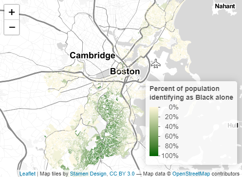

```{r setup, include=FALSE}
knitr::opts_chunk$set(echo = TRUE)
```

Note on collaboration: This portfolio follows the layout provided by Carole Voulgaris. The visuals demonstrated here are drawn, with some slight adaptations, from group assignments from the Vis2128 class and thus include ideas and code originally from my group members, which varied week by week. 

This portfolio demonstrates each of the following skills:

* Displaying multiple vector layers on the same map
* Calculating and displaying relationships among point and polygon layers based on distance
* Aggregating point data to a layer of polygons
* Calculating and displaying accessibility, based on travel time
* Converting between raster layers and vector layers
* Displaying raster data on a map
* Georeferencing a raster image
* Displaying data on an interactive map

# Maps of Boston
Here are two maps of Boston. I might include some text here about this set of maps.

## Interactive Map
This interactive map demonstrates the following skills: 

* Displaying data on an interactive map

<!-- [](https://c-voulgaris.github.io/portfolio_examples/fullsize/inter_black.html){target="_blank"} -->

<!-- [](https://evancmackay.github.io/Vis2128//fullsize/inter_black.html){target="_blank"} -->


