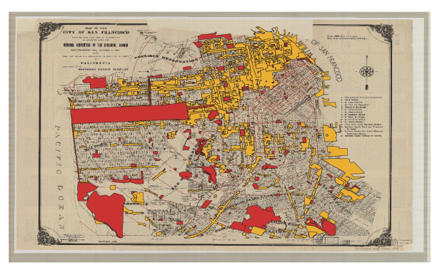
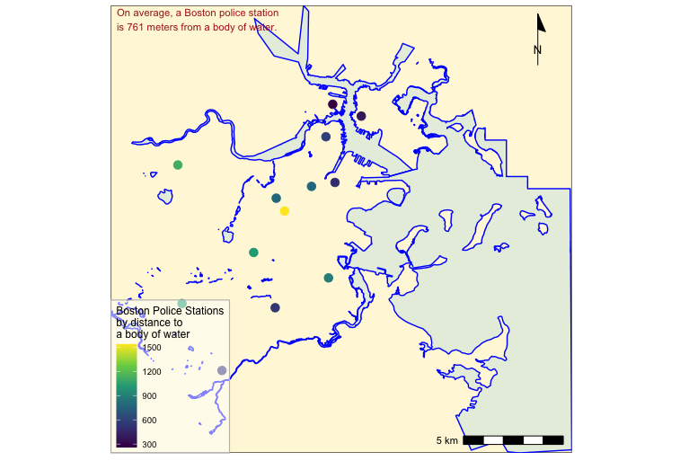
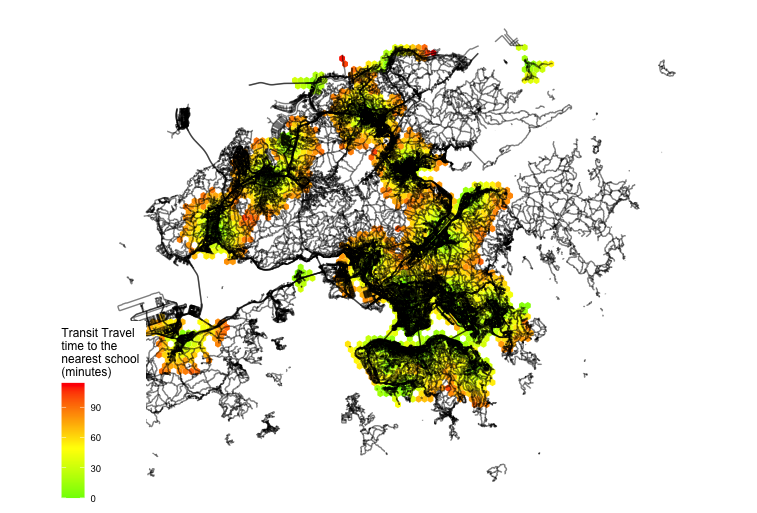

```{r setup, include=FALSE}
knitr::opts_chunk$set(echo = TRUE)

# install.packages("gitcreds")
# library(gitcreds)
# gitcreds_set()

```

Note on collaboration: This portfolio follows the layout provided by Carole Voulgaris. The visuals demonstrated here are drawn, with some slight adaptations, from group assignments from the Vis2128 class and thus include ideas and code originally from my group members, which varied week by week. 

This portfolio demonstrates each of the following skills:

* Displaying multiple vector layers on the same map
* Calculating and displaying relationships among point and polygon layers based on distance
* Aggregating point data to a layer of polygons
* Calculating and displaying accessibility, based on travel time
* Converting between raster layers and vector layers
* Displaying raster data on a map
* Georeferencing a raster image
* Displaying data on an interactive map


<!-- [](https://c-voulgaris.github.io/portfolio_examples/fullsize/inter_black.html){target="_blank"} -->

# Map of San Francisco Fire and affordable housing zoning

[](https://evancmackay.github.io/Vis2128/fullsize/export_SF_housing.pdf){target="_blank"}

# Map of Boston Police Stations and Water

[](https://evancmackay.github.io/Vis2128/fullsize/DistanceFromWaterPoliceStation.pdf){target="_blank"}

# Map of Hong Kong

[](https://evancmackay.github.io/Vis2128/fullsize/HongKongTravel.pdf){target="_blank"}


# Two interactive maps of Dallas County, Mississippi

## Percentage Black

Click the census block for Black population, total population, institutionalized population, and median age

[](https://evancmackay.github.io/Vis2128/fullsize/inter_black_AL_EdmundPettusBridge_MedianAge_Institutionalized.html){target="_blank"}

## Median Income

Click the census tract for the exact median income. 

[](https://evancmackay.github.io/Vis2128/fullsize/median_earnings_tract.html){target="_blank"}
https://evancmackay.github.io/Vis2128/fullsize/median_earnings_tract.html


This visual attempts to demonstrate the importance of being able to zoom and pan throughout the visual. At first, all of Dallas County, Alabama is visible. However, if a viewer wants to investigate the city of Selma, AL they are able to do so. Additionally, they are able to investigate the Edmund Pettus Bridge in downtown Selma which separates the North and South side. I wanted to investigate this location to see if there was a visible persisting racial segregation along this bridge. I think that many things in Dallas County have changed since the Edmund Pettus Bridge became infamous in 1965. Specifically, Civil Rights and voting suffrage activists were largely successful, and Selma was later the site of Black political power and racial justice organizing in the second half of the 20th century. It, and Dallas County, now have a history of Black political leadership with close connections to the Civil Rights Movement. The racial turnover visible in this map is likely the result of white flight from the area just South of the Edmund Pettus Bridge. 

To be clear, this close analysis would not have been possible in just one visual without interactivity. It is the interactivity which enables investigation at the large scale of all of Dallas County and also smaller scale investigation to find that census blocks on either side of the bridge are near 100% Black. 

I also include information on the institutionalized population, which can include people who live in a college dorm, on a military base, in a residential care facility for seniors, or jails or prisons. 

Additionally, many analyses have demonstrated a trend since 2000 of depopulating rural Black communities driven by the exodus of young people from these communities. For this reason, I also include the median age. 


